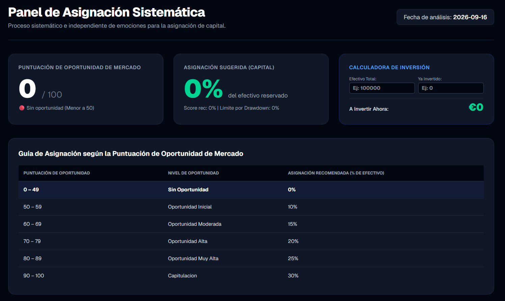
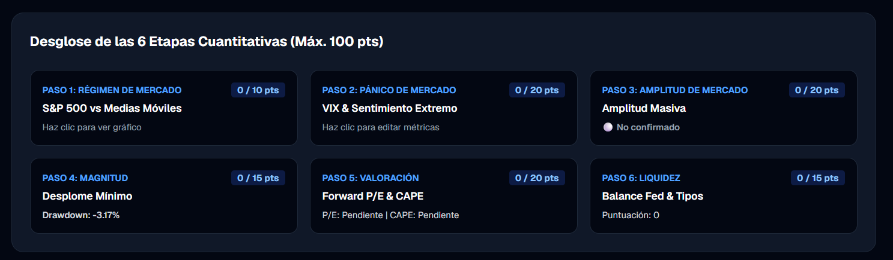
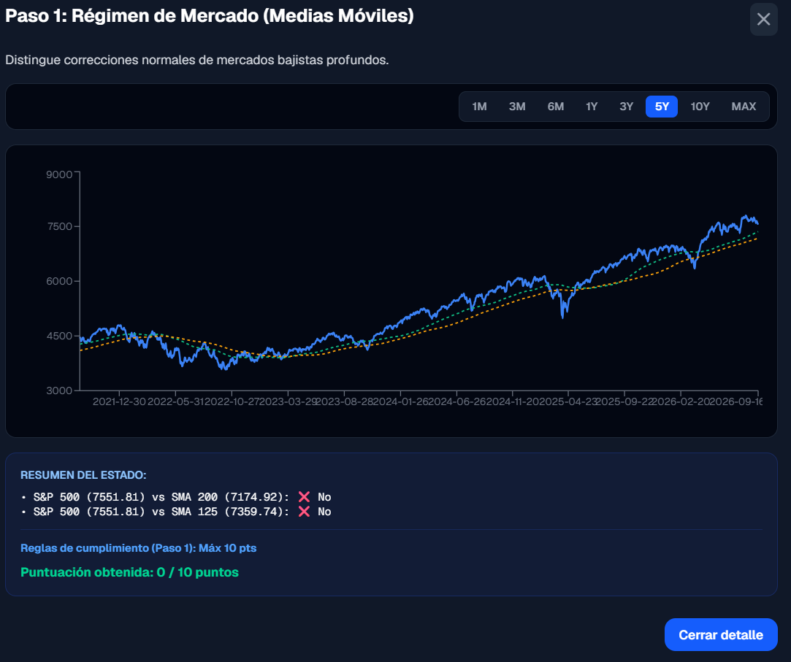
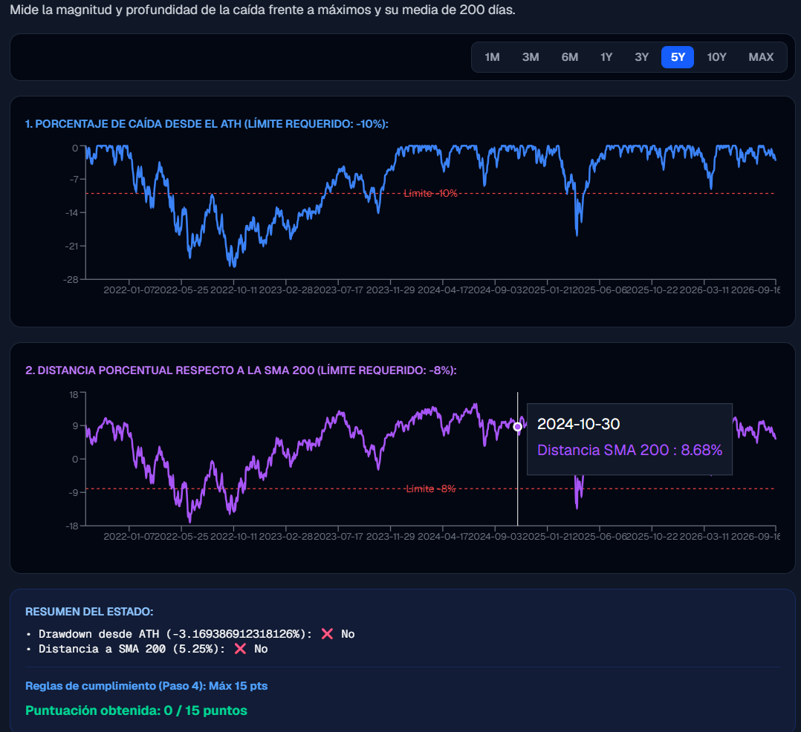

# Market App

Full-stack application for automated market data analysis and monitoring. The system processes financial metrics, such as the S&P 500 and VIX, to calculate opportunity scores through a rule-based system. S&P 500 and VIX data are automatically updated on application startup; the rest of the data is entered manually.

## Tech Stack

* Python
* FastAPI
* PostgreSQL
* Next.js
* TypeScript

## Features

* Automatic S&P 500 and VIX data updates on startup.
* Market metrics processing.
* Opportunity score calculation.
* S&P 500 and VIX analysis.
* Metrics visualization through the frontend.

## Data Flow

Financial data

↓

fetch_data.py

↓

PostgreSQL

↓

engine.py

↓

Opportunity Score

↓

FastAPI

↓

Next.js

↓

Visual interface

## Getting Started

### Prerequisites

Make sure you have the following installed:

* Python
* Node.js
* PostgreSQL

### 1. Set up the database

Open your PostgreSQL terminal (or your preferred client) and connect to the server.

Create a new database for the project, for example:

```sql
CREATE DATABASE market_db;

```

Make sure to configure the connection credentials (user, password, host, and port) in your Python project so the application can connect to this database.

### 2. Start the backend (FastAPI)

Install the Python dependencies:

```bash
pip install -r requirements.txt

```

Start the FastAPI server with Uvicorn:

```bash
uvicorn api:app --reload

```

### 3. Start the frontend (Next.js)

Go into the frontend folder:

```bash
cd frontend

```

Install the Node dependencies:

```bash
npm install

```

Run the development server:

```bash
npm run dev

```

The frontend will be available at:

[http://localhost:3000](http://localhost:3000)




